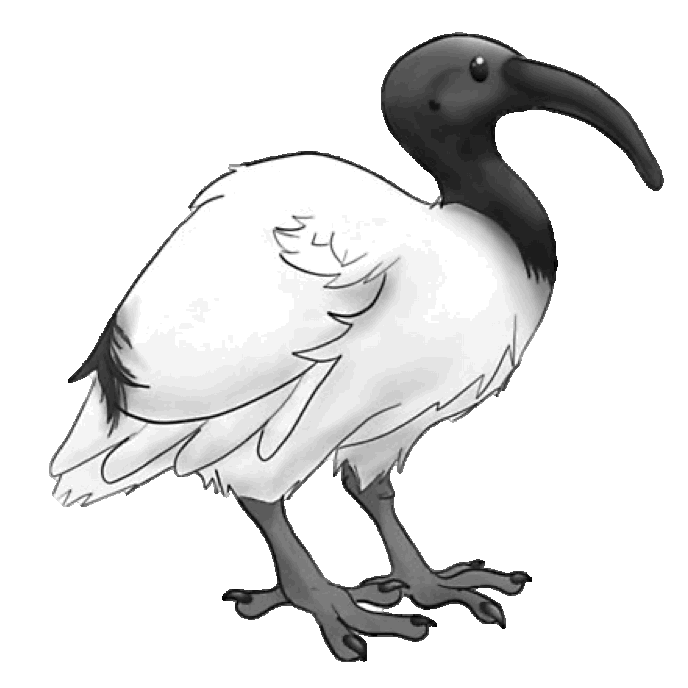

# 🗝️ Key Cave Adventure Game

A single-player GUI-based game developed using Python and `tkinter`, created as part of the CSSE1001 coursework for the Master's in Data Science. The game follows the Apple Model-View-Controller (MVC) architecture.

## 🎮 Gameplay

You play as an ibis whose mission is to collect trash (keys) and bring it to the nest (door), avoiding obstacles and managing your remaining moves.

- Use **W, A, S, D** keys or click the on-screen keypad to move.
- Collect items like bananas to gain more moves.
- Reach the nest while holding a key to win.

## 🛠️ Features

- 🎨 GUI with `tkinter`, rendered using rectangles or images
- 📦 OOP design with `Entity`, `Player`, `Key`, `Wall`, and `GameLogic` classes
- 💾 Save/Load game state
- 🕒 Status bar with timer and remaining moves
- 🧬 Extra (postgrad mode): undo moves using "lives", track top 3 high scores

## 🖼️ Screenshots

| Basic Dungeon Map | Advanced with Images |
|------------------|----------------------|
|  |  |

> Replace with actual screenshots if available

## 📁 File Structure

- `a3.py` – Main application (single file as per assignment requirement)
- `images/` – Entity and UI assets (GIFs)
- `game2.txt` – Sample level file

## ▶️ Getting Started

### Requirements
- Python 3.7+
- `tkinter` (usually included)
- `Pillow` for image rendering

### To Run:
```bash
python a3.py
```

## 🧪 Controls
| Action         | Key/Input    |
|----------------|--------------|
| Move Up        | W / click 'N' |
| Move Down      | S / click 'S' |
| Move Left      | A / click 'W' |
| Move Right     | D / click 'E' |
| Save Game      | File > Save Game |
| Load Game      | File > Load Game |
| Use Life       | Use Life button (Postgrad mode only) |

## 🧠 Learnings
- Implemented Apple MVC architecture in a real-world GUI project.
- Practiced object-oriented programming with reusable components.
- Managed game state, save/load functionality, and timers.
- Applied tkinter and Pillow for UI and graphics.
- Learned version control and modular design during development.

## 📚 Course Info
This game was developed for **CSSE1001 – Introduction to Software Engineering** as part of the **Master of Data Science** program at **The University of Queensland**.
